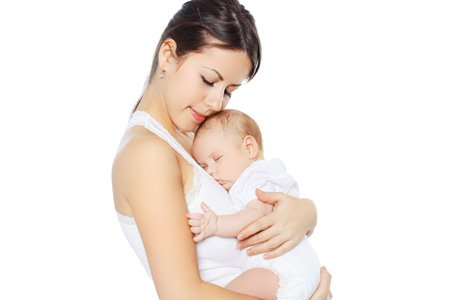

# Отпуск
- временное освобождение от работы в будние дни на определённый период времени для отдыха и иных социальных целей с сохранением прежнего места работы.
---

## Виды отпуска:
* по временной нетрудоспособности
* декретный отпуск
* отпуск по уходу за ребёнком
* бессрочный отпуск

### По временной нетрудоспособности

### Декретный отпуск

### Отпуск по уходу за ребенком
- В соответствии со ст. 256 Трудового кодекса РФ по заявлению женщины ей предоставляется отпуск по уходу за ребенком до достижения им возраста 3 лет.

### Бессрочный отпуск