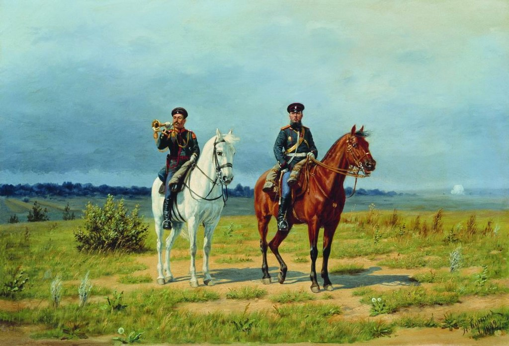

# Отпуск
- временное освобождение от работы в будние дни на определённый период времени для отдыха и иных социальных целей с сохранением прежнего места работы.
---

## Виды отпуска:
* по временной нетрудоспособности
* декретный отпуск
* отпуск по уходу за ребёнком
* бессрочный отпуск

### По временной нетрудоспособности

### Декретный отпуск

### Отпуск по уходу за ребенком

### Бессрочный отпуск
- особый вид прохождения военной службы в Русской императорской армии, и Российском императорском флоте.
